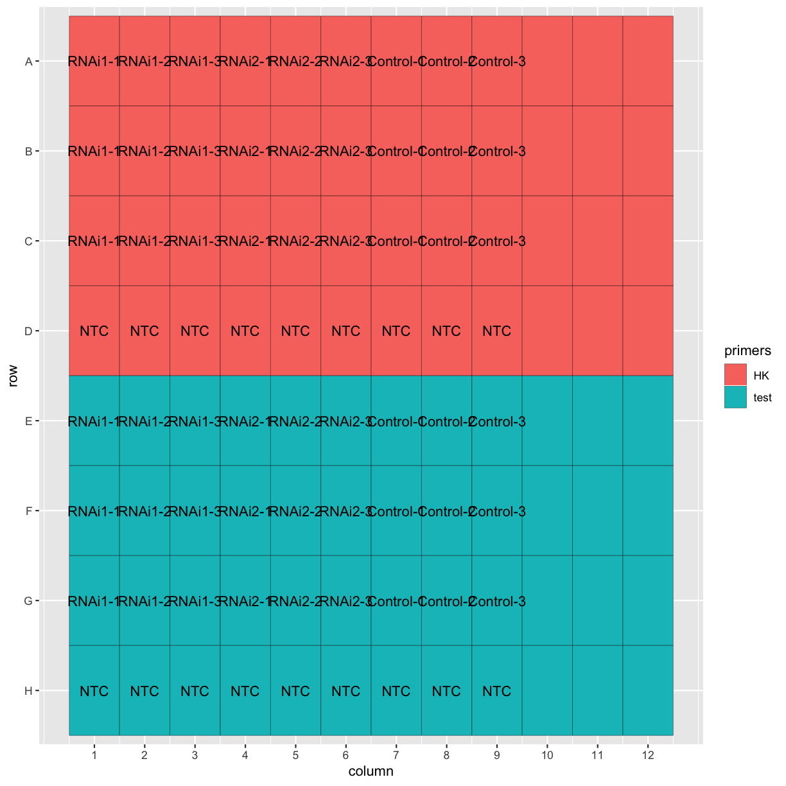
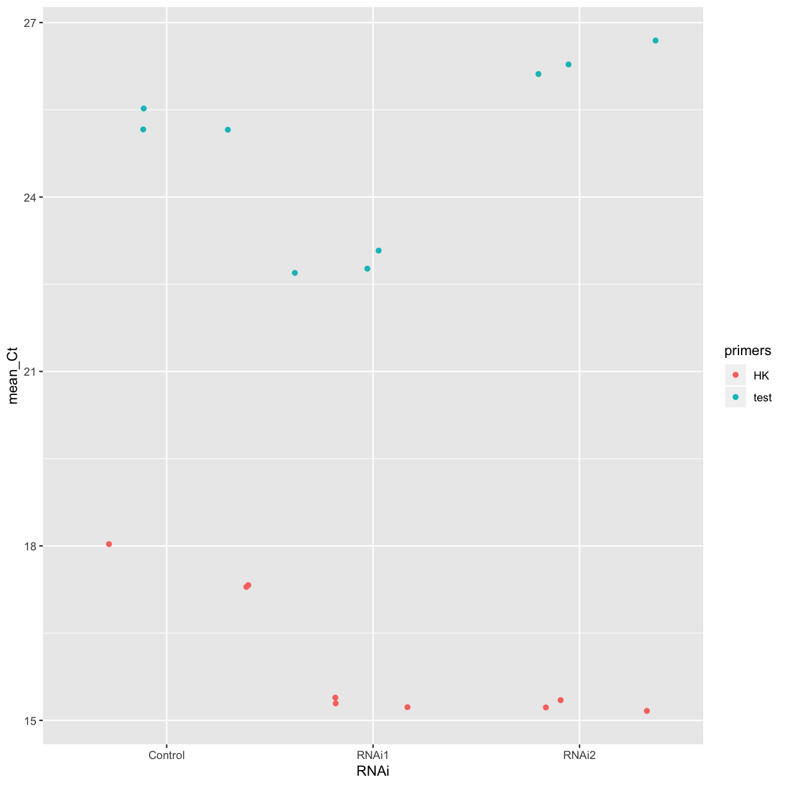
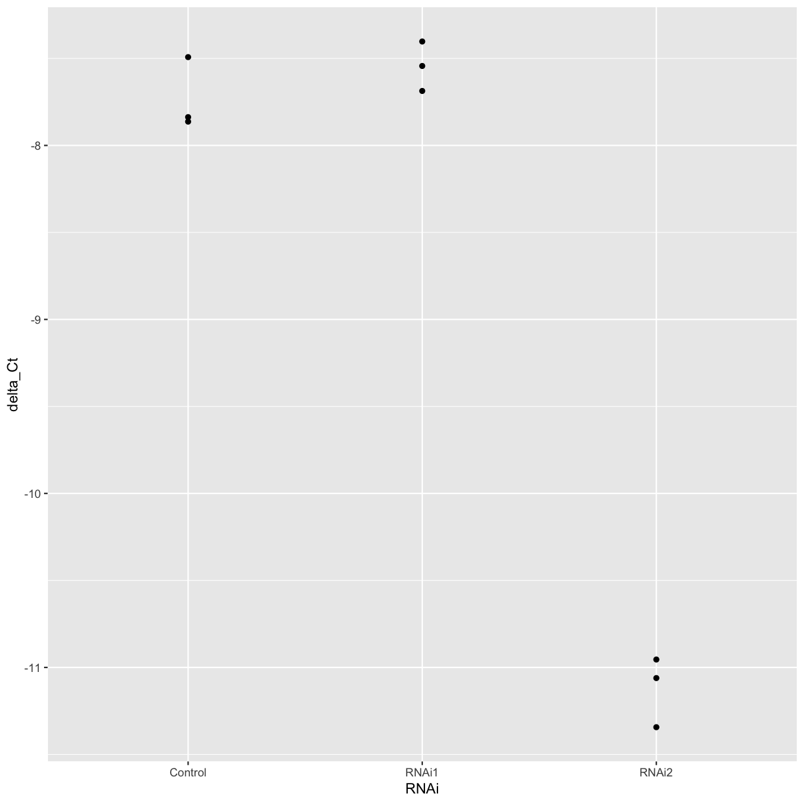
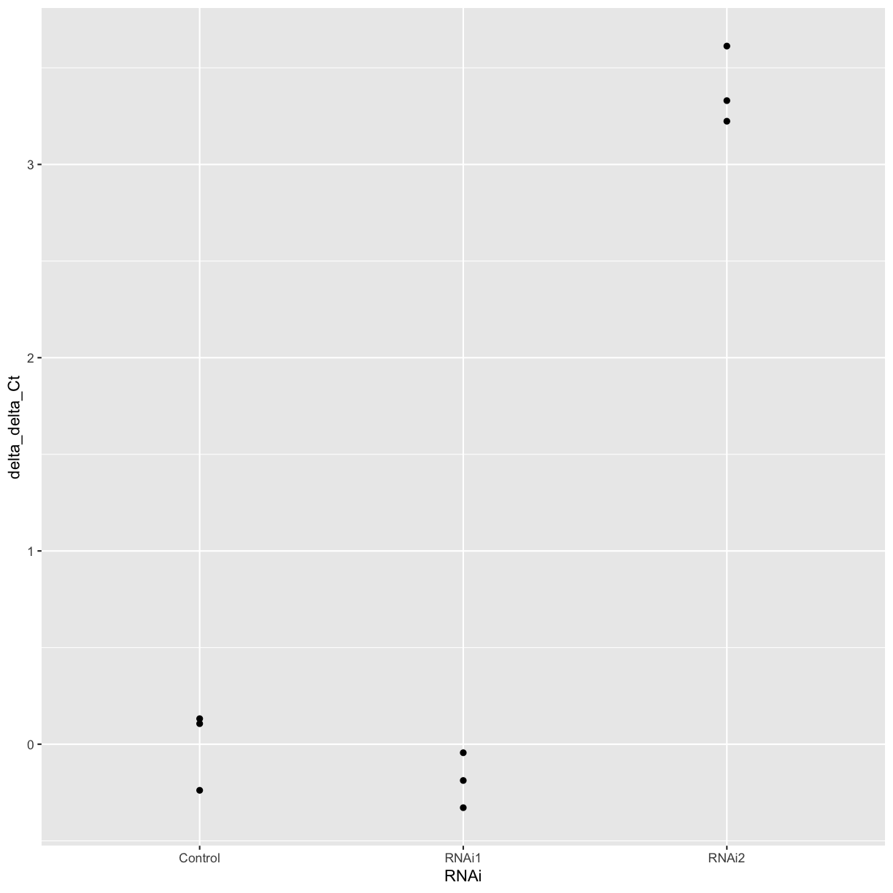
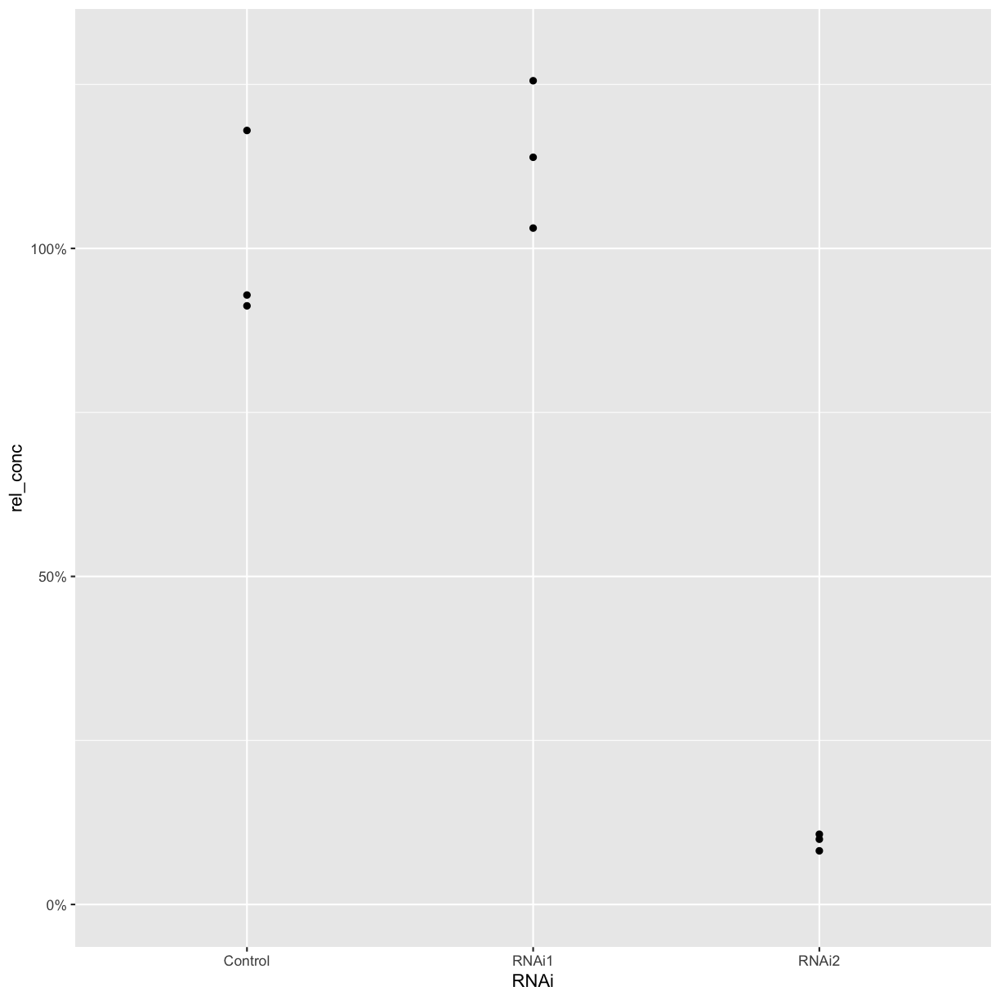
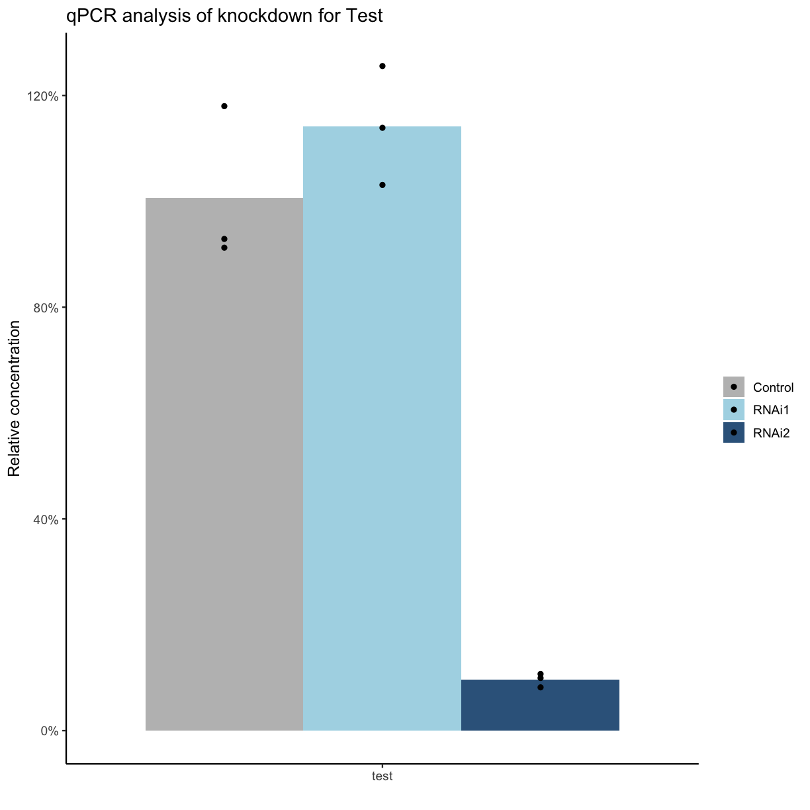

---
# Please do not edit this file directly; it is auto generated.
# Instead, please edit 02-analyse-data.md in _episodes_rmd/
title: Analysing qPCR data
teaching: 40
exercises: 30
questions:
- "How can I analyse qPCR data in R?"
objectives:
- " To combine data across replicates using `group_by()` and `summarise()`."
- " To create a reference data frame using `filter()."
- " To calculate differences between reference and sample data."
keypoints:
- " There is a lot of data wrangling involved in data analysis!"
- " The `group_by()` and `summarise()` functions are useful for calculating means across groups of samples."
- " The `mutate()` function can be used to store the results of calculations in a new column."
- " Using R for analysis help make the analysis reproducible."
source: Rmd
---

Now that we've imported our data and confirmed the plate layout by plotting it, let's get to the actual analysis! This dataset has two different RNAi treatments and a control, with three biological replicates for each. Each biological replicate has three technical replicates, as well. 

~~~
ggplot(tidy_data, aes(x = column, y = row, fill = primers, label = Sample.Name)) +
  geom_tile(colour = "black") +
  geom_text() +
  scale_y_discrete(limits = c("H", "G", "F", "E", "D", "C", "B", "A")) +
  scale_x_continuous(breaks = 1:12)
~~~
{: .language-r}

## Calculating average Ct values

We want to know whether the RNAi treatments are effective at knocking down our gene of interest. To do this, we will first calculate the average across technical replicates, then compare the Ct of our gene of interest to a housekeeping gene, then compare the treated samples with the control.

First let's remove the "NTC" (no template control) and empty wells from the dataset.

~~~
tidy_data <- filter(tidy_data, Sample.Name != "NTC", Sample.Name != "")
~~~
{: .language-r}

The technical replicates have the same `Sample.Name`, so we can use the `group_by()` and `summarise()` functions from `dplyr` to calculate the mean Ct across the technical replicates for each sample.

~~~
head(tidy_data$Ct)
~~~
{: .language-r}

~~~
[1] "15.2104" "15.2286" "15.4853" "15.3587" "15.2092" "15.1074"
~~~
{: .output}

~~~
class(tidy_data$Ct)
~~~
{: .language-r}

~~~
[1] "character"
~~~
{: .output}

The Ct column is stored as a character vector, so let's first convert it to numeric format.

> ## Watch out for factors!
> Factors are stored as character "labels" to underlying numeric levels. 
> Converting directly to numeric will return the levels, not the actual values 
> of the labels. If in doubt, use `as.numeric(as.character(my_factor))`. 
{: .callout}

~~~
summarised_data <- tidy_data %>%
  mutate(Ct = as.numeric(Ct)) %>%
  group_by(Sample.Name, primers) %>%
  summarise(mean_Ct = mean(Ct))

head(summarised_data)
~~~
{: .language-r}

~~~
# A tibble: 6 x 3
# Groups:   Sample.Name [3]
  Sample.Name primers mean_Ct
  <chr>       <fct>     <dbl>
1 Control-1   HK         18.0
2 Control-1   test       25.5
3 Control-2   HK         17.3
4 Control-2   test       25.2
5 Control-3   HK         17.3
6 Control-3   test       25.2
~~~
{: .output}

> ## Challenge
>
> The `Sample.Name` column contains information on both which RNAi was used and 
> the biological replicate. Use the `separate()` function from the `tidyr` 
> package to separate these into two new columns.
>
> > ## Solution
> >
> > ~~~
> > summarised_data <- summarised_data %>%
> >   separate(Sample.Name, into = c("RNAi", "replicate"), sep = "-")
> > ~~~
> > {: .language-r}
> {: .solution}
{: .challenge}

Let's plot the mean Cts for each treatment for a quick comparison. Does it look like either of the RNAi treatments was effective in this experiment?

~~~
ggplot(summarised_data, aes(x = RNAi, y = mean_Ct, colour = primers)) +
         geom_point()
~~~
{: .language-r}

## Using the delta-delta-Ct method 

One common way of analysing qPCR data is to use the "delta-delta-Ct" method. This involves calculating the difference between the Ct of the housekeeping gene and the test gene, then calculating the difference between the treated samples and the control.

First, let's separate the different primer sets into different data frames, and rename the `mean_Ct` column in the reference data. 

~~~
test_data <- summarised_data %>%
  filter(primers == "test")

ref_data <- summarised_data %>%
  filter(primers == "HK") %>%
  rename("ref_Ct" = "mean_Ct")
~~~
{: .language-r}

Now, we can use the `left_join` function again to combine the two data frames based on the sample information.

> ## Challenge
>
> Combine the `test_data` and `ref_data` data frames to make a new data frame, 
> based on the sample information (RNAi treatment and replicate number).
>
> > ## Solution
> >
> > ~~~
> > combined_data <- left_join(test_data, ref_data, by = c("RNAi", "replicate"))
> > ~~~
> > {: .language-r}
> {: .solution}
{: .challenge}

> ## Challenge
>
> Use the `mutate` function to create a new column containing the delta Ct 
> between the housekeeping gene and our gene of interest, and plot the delta Ct 
> for each treatment and replicate. 
>
> > ## Solution
> >
> > ~~~
> > combined_data <- mutate(combined_data, delta_Ct = ref_Ct - mean_Ct)
> > ggplot(combined_data, aes(x = RNAi, y = delta_Ct)) +
> >   geom_point()
> > ~~~
> > {: .language-r}
> {: .solution}
{: .challenge}

> ## Challenge
>
> Calculate the mean delta Ct for each treatment.
>
> > ## Solution
> >
> > ~~~
> > treatment_summary <- combined_data %>%
> >   group_by(RNAi) %>%
> >   summarise(mean_delta_Ct = mean(delta_Ct))
> > ~~~
> > {: .language-r}
> {: .solution}
{: .challenge}

Now we can calculate the delta delta Ct of each replicate compared to the mean of the control sample.

~~~
mean_control <- filter(treatment_summary, RNAi == "Control") %>% pull(mean_delta_Ct)

combined_data <- combined_data %>% 
  mutate(delta_delta_Ct = mean_control - delta_Ct)

ggplot(combined_data, aes(x = RNAi, y = delta_delta_Ct)) +
  geom_point()
~~~
{: .language-r}

## Calculating relative DNA concentration

If you want to calculate the relative DNA concentration, you can use the fact that the amount of cDNA theoretically doubles every cycle.

> ## Challenge
>
> What is the relative expression of our gene of interest in the RNAi-treated 
> samples compared to the control?
> 
> Use the formula: `relative_conc = 2 ^ - delta_delta_Ct`. 
>
> > ## Solution
> >
> > ~~~
> > combined_data <- combined_data %>%
> >   mutate(rel_conc = 2^-delta_delta_Ct)
> > ~~~
> > {: .language-r}
> {: .solution}
{: .challenge}

> ## Primer efficiency
> Not all primer pairs are 100% efficient! If you have experimentally calculated 
> the efficiency for your primers, you can use the experimentally calculated 
> value in place of the 2. Since the primers for the hosuekeeping gene and genes
> of interest can have different efficiences, it's best to calculate the 
> cDNA concentration in arbitrary units for each gene and sample, and then 
> calculate the differences relative to the housekeeping gene and the control.
{: .callout}

We can now plot the relative concentration. 

~~~
ggplot(combined_data, aes(x = RNAi, y = rel_conc)) +
  geom_point() +
  scale_y_continuous(labels = scales::percent, limits = c(0, 1.3))
~~~
{: .language-r}

> ## Challenge
>
> Create a new column with the mean relative concentration for each sample. Plot
> the mean values as a bar graph, with the values for each biological replicate 
> also plotted as points. When you have only a few replicates, it's best 
> practice to show the individual points rather than plotting a standard error 
> or standard deviation.
> 
> If you want, customise the axis labels, title, etc of your plot.
>
> > ## Solution
> > ~~~
> > combined_data <- combined_data %>%
> >   group_by(RNAi) %>%
> >   mutate(mean_rel_conc = mean(rel_conc))
> > 
> > ggplot(combined_data, aes(x = primers.x, y = mean_rel_conc, fill = RNAi, group = RNAi)) +
> >   geom_col(position ="dodge") +
> >   geom_point(aes(y = rel_conc), position = position_dodge(width = 0.9)) +
> >   scale_y_continuous("Relative concentration", labels = scales::percent) +
> >   scale_fill_manual("", values = c("Control" = "grey", "RNAi1" = "lightblue", "RNAi2" = "steelblue4")) +
> >   scale_x_discrete("") +
> >   ggtitle("qPCR analysis of knockdown for Test") +
> >   theme_classic(base_size = 12)
> > ~~~
> > {: .language-r}
> {: .solution}
{: .challenge}

## Reproducibility

Biologists often have to analyse multiple similar datasets - for example, the same qPCR plate layout with different primers or different samples. Using R for analysis means that you can re-run an analysis on a new dataset much more quickly than by doing the calculations by hand each time. 

Another advantage of using R for analysis is that you can use [knitr/Rmarkdown](http://swcarpentry.github.io/r-novice-gapminder/15-knitr-markdown/index.html) to generate nicely-formatted html, pdf, or docx reports from your code. These can contain plots and tables of results, as well as your interpretation of the results and any notes. 

> ## Challenge
>
> Create an Rmarkdown document that contains all the code needed to read in and 
> analyse a qPCR dataset. You should also include a short introduction to the 
> experiment, and your interpretation of the results.
{: .challenge}
